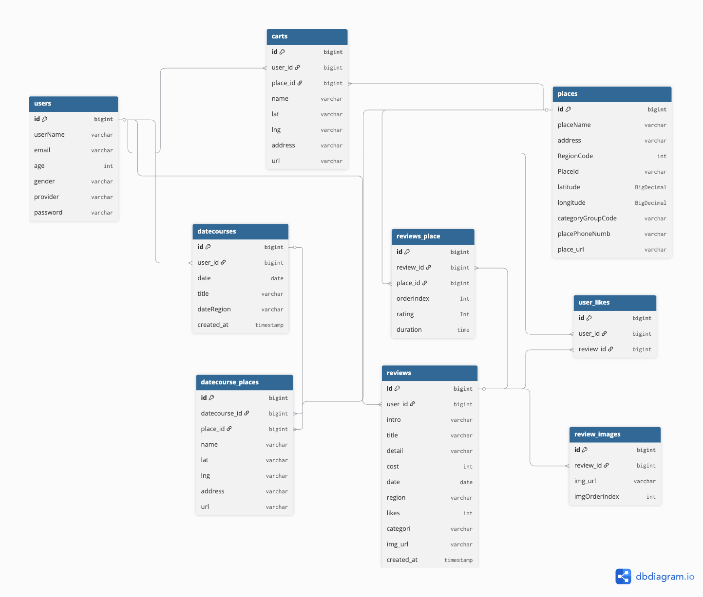

# 🌆 SeoulMate

**실시간 혼잡도·인구 데이터 기반 데이트 플래너

<p align="center">
  
</p>

<br />

## 😀 프로젝트 소개

---

✏ **프로젝트명**
- **SeoulMate(서울메이트)**

💖 **서비스 소개**
- 서울시 실시간 인구/혼잡도, 주차/대중교통/행사 정보를 모아 **최적의 데이트/나들이 코스**를 계획
- 코스 작성·수정·공유와 리뷰/장바구니 기능으로 **준비–이동–체크–기록**의 전체 여정을 지원

✨ **서비스 특징**
- **실시간 데이터 융합**: 서울 열린데이터(혼잡도·행사·따릉이·주차장 등) + 카카오(검색/길찾기) + ODsay(대중교통) 결합
- **시각화 UX**: 지도/차트 기반 **인구·성별·연령 분포** 및 도로 혼잡도 가시화

👤 **대상 사용자**
- 주말/데이트 동선을 효율적으로 짜고 싶은 서울 생활자
- 붐비는 시간대를 피해서 **쾌적한 코스를 계획**하고 싶은 사람

☝🏻 **주요 기능**
- **헬스/도시 데이터 리포트**(혼잡도·연령·성별 분포)
- **장바구니/찜** & **리뷰 작성**
- **경로탐색**(자동차/대중교통/도보)
- **이벤트/날씨/교통** 정보 연동

<br />

## 🎠 배포 환경

- **URL**: https://seoul-mate.co.kr

🗓 **진행 일정**
- `2025.06 ~ 2025.11` 

<br />

## 🚩 프로젝트 요약

| Application | Domain | Language | Framework |
|---|---|---|---|
| ✅ Desktop Web | ✅ Data/Maps | ✅ Java | ✅ Spring Boot |
| 🔲 Mobile App | ✅ Recommender | ✅ JavaScript | ✅ React |
| 🔲 iOS/Android | 🔲 AI/ML | 🔲 TypeScript | 🔲 Vue/Etc. |

> 실제 사용 스택은 아래 “기술 스택”을 참조하세요.

<br />

## 📢 주요 기능 상세

### 1) 메인 화면
- **지역구별 혼잡도 히트맵**: 실시간(약 **10분 단위**) 생활인구 기반 혼잡도를 색상으로 표시
- **진입 시퀀스**: 지역구 혼잡도 지도 → 장소 지도 → **장소 선택**

<p align="center">
  
</p>

### 2) 장소 지도
- **실시간 인구 지표**: 현재 인구수, **성별 비율**, **연령대 분포(20·30대 등)**
- **주요 행사 일정**: 전시/페스티벌/공연 **핀** 및 기간·위치 표시
- **날씨 정보**: 현재/예보(강수·체감온도·바람)
- **따릉이/주차장**: 대여소 위치·대수, 공영주차장 위치 표시
- **도로 혼잡도**: 선택 장소 인근 주요 도로의 **실시간/예측** 혼잡도
- **검색/필터**: 지역구·동·키워드 **장소 검색/추가**

<p align="center">
  
</p>

### 3) 리뷰
- **장바구니 연동**: 리뷰에서 **장소를 바로 장바구니 담기**
- **데이트 카테고리 태그**: 활동/분위기 등 **태그 분류·필터**
- **리뷰 내 장소 액션**: 리뷰에 등장한 장소를 **즉시 장바구니 추가**

<p align="center">
  
</p>

### 4) 코스
- **경로 탐색(이동수단별)**: 도보/대중교통/자동차 경로, **소요시간·환승 정보**
- **즉시 편집**: 드래그&드롭으로 순서 변경, 장소 **추가/삭제**, 실시간 저장
- **현장 최적화**: 현재 **혼잡·날씨** 데이터를 반영해 **즉각 코스 수정**

<p align="center">
  
</p>

<br />

## 💾 ERD

<p align="center">
  
</p>

<br />

## 🔧 기술 스택

```text
[ Backend ]
- Java 17
- Spring Boot `3.4.3` 
- Spring Dependency Management `1.1.7`
- Gradle
- JWT `0.11.5` 
- Lombok
- DB: MySQL(RDS) `8.0.42`, Connector/J `8.0.29`

[ Frontend ]
- npm `8.18.0`
- React `19.1.0` / CRA(`react-scripts 5.0.1`)
- Router: `react-router-dom 7.5.3`
- UI: MUI `7.1.2` + Emotion
- Charts: ECharts `5.6.0`
- Maps: `react-kakao-maps-sdk 1.2.0`
- HTTP: `axios 1.9.0`
- Auth: `jwt-decode 4.0.0`
- Drag & Drop: `@dnd-kit` (core/sortable)

[ DB ]
- MySQL `8.0.30`

[ DevOps ]
- Docker
- Nginx
- GitAction
- AWS EC2

[ Storage ]
- S3 Bucket

[ IDE ]
- IntelliJ
- VSCode

[ Data Sources / API ]
- 서울 열린데이터
- Kakao Local/Search, Kakao Mobility Directions
- ODsay 대중교통 경로

[ Tools ]
- GitHub
- Notion 
